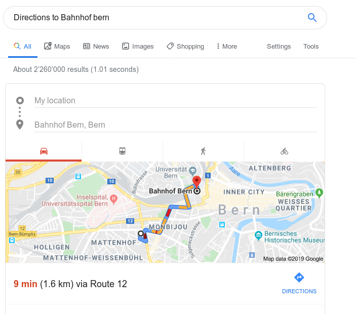
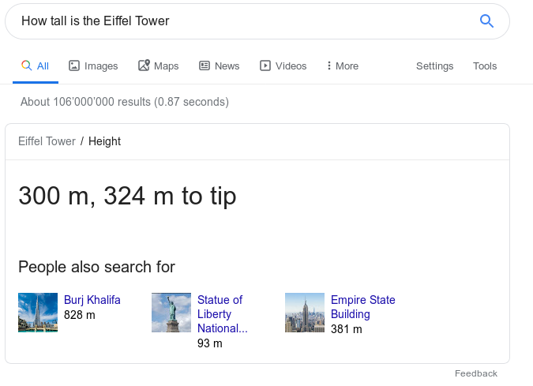

<!-- .slide: class="master01" -->

<!-- section -->

#Suchmaschinen und wie man sie benutzt

<!-- .slide: class="master04" -->

<!-- slide -->

## Inhalt

- Was ist eine Suchmaschine?
  - Welche gibt es?
- Wie funktioniert das eigentlich?
- Wie benutzt man eine Suchmaschine?

<!-- section -->

# Die Suchmaschine(n)

<!-- .slide: class="master05" -->

<!-- slide -->

## Definition

- Applikation
- Durchsucht das Web anhand des Suchbegriffs

<!-- slide -->

## Maschinen

</img>
</img>
</img>
</img>
</img>

<!-- section -->

# Wie geht das?

<!-- .slide: class="master05" -->

<!-- slide -->

## Beispiel Google

- Verbreitesten
- Zuverlässig
- Nur Standartsuche (kein Bilder, Videos, ...)

<!-- slide -->

## Indexierung des Webs

- Web Crawlers durchsuchen das Netz
- Organisieren es im Suchindex
- Beachtet das Alter der Seite
- Weit über 100'000'000 Gigabytes gross

<!-- slide -->

## Der Webcrawler

- Durchsucht Webseiten nach Links
- Merkt sich neue oder tote Links

<!-- slide -->

# Suchalgorithmen

<!-- .slide: class="master04" -->

<!-- slide -->

## Bedeutung der Suche

- Erkennt Synonyme und setzt sie in Kontext
- Untersucht ob spezifisch oder umfassend
  - Öffnungszeiten Migros
  - Wie funktioniert Google?

<!-- slide -->

## Relevanz der Webseiten

- Sucht nach deinen Wörtern
- Sucht nach Wörtern im selben Kontext

<!-- slide -->

## Sonstiges

- Qualität und Verlässlichkeit
- Benutzerfreundlichkeit
- Kontext wie Suchverlauf oder Standort

<!-- slide -->

# Präsentation

<!-- .slide: class="master05" -->

<!-- slide -->

</img>

<!-- slide -->

</img>

<!-- section -->

# Wie suche ich denn effektiv?

<!-- .slide: class="master05" -->

<!-- slide -->

## Grundsätzlich

- Schlüsselwörter benutzen
- Möglichst spezifisch sein

<!-- slide -->

# Was ist das für eine Ofen Einstellung?

<!-- .slide: class="master04" -->

<!-- slide -->

## Was will ich?

- Fixe Information vom Hersteller
- Nur eine Quelle
- Klares Modell
- **Anleitung** --> Dokument

<!-- slide -->

## Was muss ich eingeben?

A. **Bauknecht BAR2 KH8V2 Anleitung**

B. **Was ist die dritte Einstellung von meinem Bauknecht Backofen?**

<!-- slide -->

# Was sind die aktuellen Krimi Bestseller?

<!-- .slide: class="master04" -->

<!-- slide -->

## Was will ich?

- Bücher
- Eine Liste von Bestsellern
- In der Schweiz, aktuelles Jahr
- Klares Genre

<!-- slide -->

## Was muss ich eingeben?

A. **Krimi Buch Bestseller Schweiz 2019**

B. **Was sind die aktuellen Krimi Bestseller der Schweiz?**

<!-- slide -->

## Zemegfasst

- Formt Fragen zu Abfragen ("Gib mir...")
- Was wollt ihr genau wissen?
- Welches Wissen braucht die Suche?
- Stichworte!

<!-- section -->

# Rückblickend

<!-- .slide: class="master05" -->

<!-- slide -->

- Suchmaschine(n)
- Sammlung von Webseiten
- Suche durch die Sammlung
- Suche unterstützen um uns zu helfen

<!-- slide -->

# Gib mir Fragen

<!-- .slide: class="master05" -->
